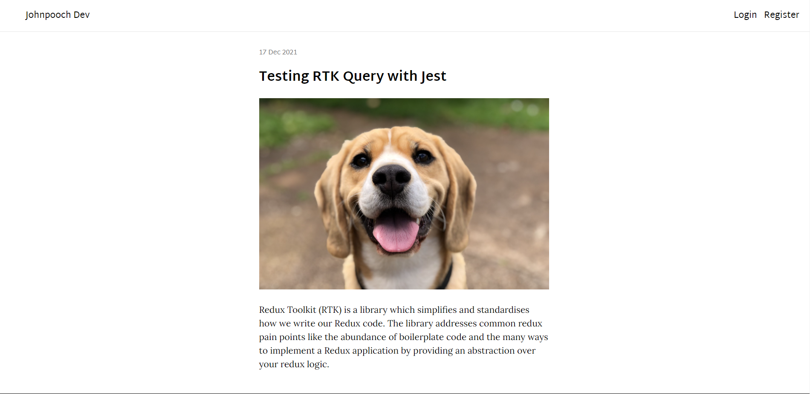
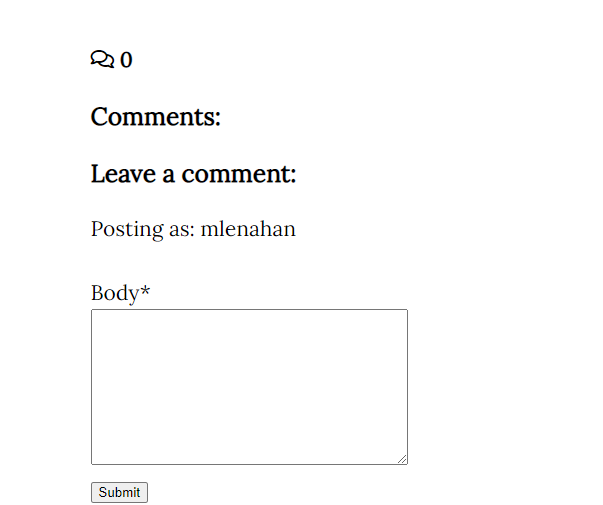
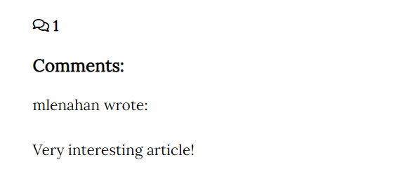
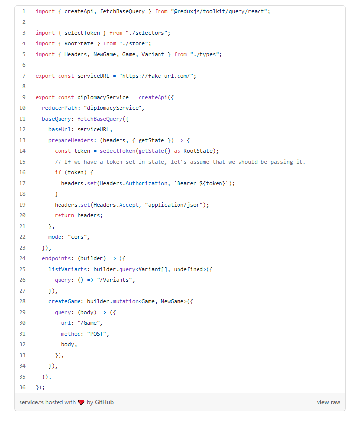

# Johnpooch.dog

### Project Goals
This site was created for my good friend, John McDowell, to use as a platform to post articles on subjects he is passionate about in the world of tech.

## Live Instance

The live instance of this site can be found [here.](http://johnpooch.dog/)

## Overview

Johnpooch.dog is a blog website created using the Django framework. The styling of this website are based on the zen style of [Medium.](https://medium.com/) The structure and features are that of a typical blog website other than some extra features I've had to add in for correct funtionality of the site.

This website will be a place to read about all the languages, frameworks and technologies that John is interested in as a developer.

# User Experience (UX)

## Strategy

* User Goals
    * I want to be able to browse various articles on the site
    * I want an appealing and easy to navigate site

* Site Owner Goals 
    * I want the site to be accessible and responsive to allow users on all devices to be able to browse the site
    * I want the site to have interesting and engaging articles to build up an audience
    

## User Stories

* First Time Visitor 
    * I want to understand the main purpose of the site
    * I want to see an appealing and easy to navigate site
    * I expect the site to be accessible to all devices
    * I want to easily register for an account

* Unregistered Visitor
    * I want to be able to view all articles that are available for me to read
    * I want to be able to select and read individial articles

* Registered Visitor
    * I want to be able to log in and log out
    * I want to be able to comment under invididual articles
    * I want to be able to easily follow the author on GitHub and LinkedIn
    * I want to be able to change my password if I forget it
    * I want to recieve feedback that my comment is awaiting approval

* Superuser
    * I want to be able to add, delete or edit articles
    * I want to be able to approve and delete comments posted by registered users
    * I want to be able to delete a user
    * I want to be able to edit and delete tags
    * I want to have to ability to give give other users admin status
    
# Features

## Existing Features

- __The landing page__

    

    - The landing page of this site is a simple one consisting of all the articles that have been written. What you will see is the image and an excerpt from the article.

- __The nav bar__

    

    - This site has a simple navbar consisting of site title which acts as a home button and depending on whether you're logged in or not, a login and register button or a logout button.
    - This is featured across all pages.

- __The footer__

    

    - This site has a simple footer consisting of social media links to John's LinkedIn and GitHub.
    - This is featured across all pages.

- __The About__

    

    - The about section is a small and concise piece about who John is and what he is interested in and what you may see feature on the blog.

- __The comment section__

    

    - The site features a comment section that allows registered users to comment on the various posts on the site

    

    - Once a registered user has posted a comment, they will be given feedback to show that the comment has been sent for moderation. Comments have to be approved by an admin to avoid inapropriate or unwanted comments.

    

    - Once the comment has been approved, it will be visible under the post on which it was posted.

- __Custom gist and code snippets__

    

    

    - This site uses [Django Summernote](https://github.com/summernote/django-summernote) which provides WYSIWYG editor for creating and editing blog posts. By default, Django Summernote escapes all HTML tags. This meant that embedding Gist scripts would not work as expected. To work around this, I wrote a function using the Regex library that looks for escaped gist scripts and replaces them with un-escaped script tags. Additionally, inline code-snippets are commonly added using back-ticks ("`code snippet`"). This behaviour is not natively supported by Django Summernote. To achieve this behaviour, the `parsed_content` method also replaces back-ticks with `` tags that can be targeted in CSS to make them appear as code snippets. [Link to code.](https://github.com/mlenahan/ms4-django/blob/aa217116894a66741eeb9d2629f77b59cb40c5dd/blog/models.py#L48)

## Features to implement

- __Email post notifications__

    - In the future, I would love to implement a feature that sends all registered users an email when a new article is posted. This would be a great way of letting all registered users know that a new article has been posted.
    

