# Testing

## Automated Testing

The W3C Markup Validator and W3C CSS Validator were used to validate every page of the project to ensure there were no syntax errors in the project.

-   ## [W3C Markup Validator](https://validator.w3.org/)

    - index.html
       * No errors found.

    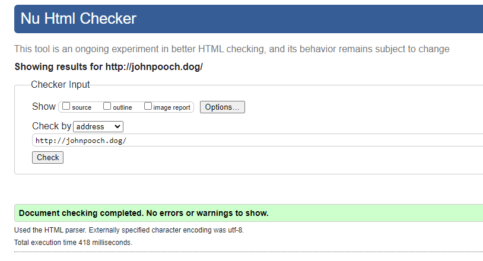

    - post_detail.html
       * No errors found.

    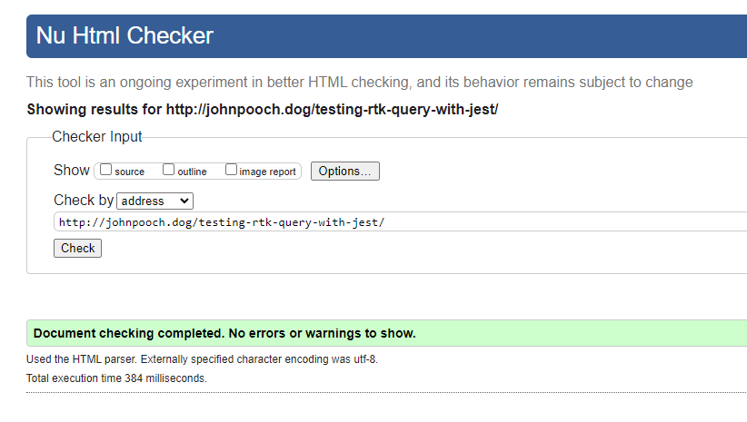

-   ## [W3C CSS Validator](https://jigsaw.w3.org/css-validator/#validate_by_input) 
    
       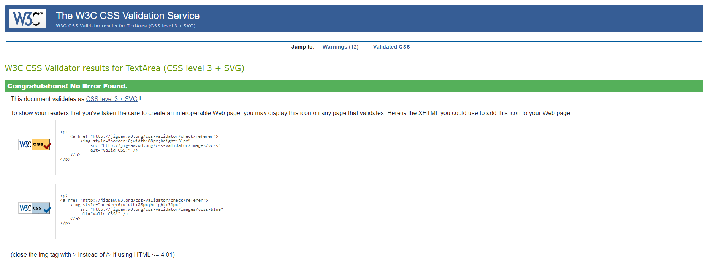

       - Warnings due to use of CSS variables

       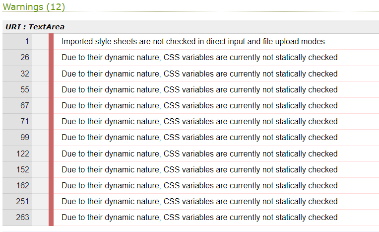

-   ## [Pep8 validation](http://pep8online.com/)

    - All python files have been passed through the pep8online validation service. Only one file contains errors and that is `test_models.py`. The two errors present in this file are line too long errors for the function names. From my research, it is not good practice to split the name of a function so I have left them on one line.

        - models.py

        - 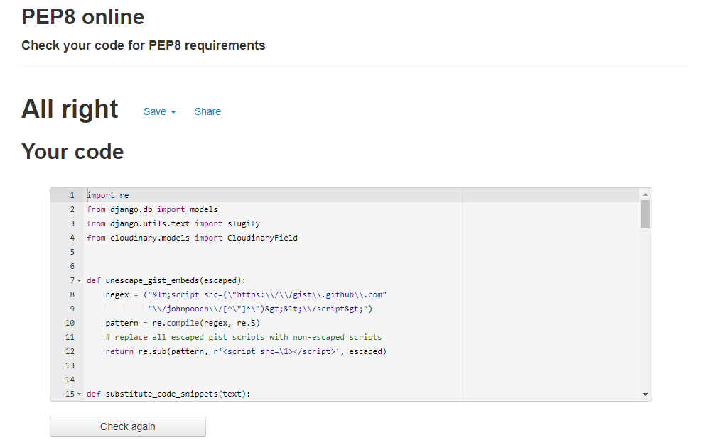

        - admin.py
        
        - 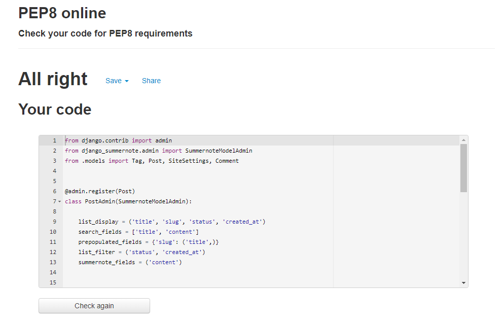

        - apps.py.py
        
        - 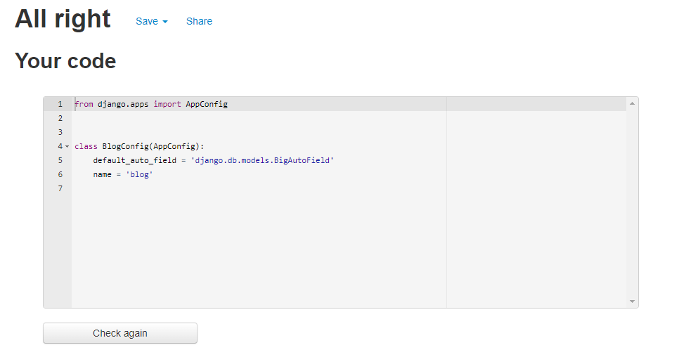

        - forms.py
        
        - 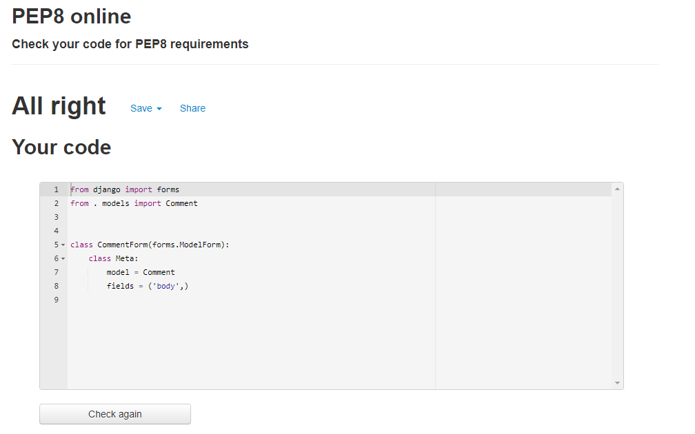

        - test_models.py
        
        - 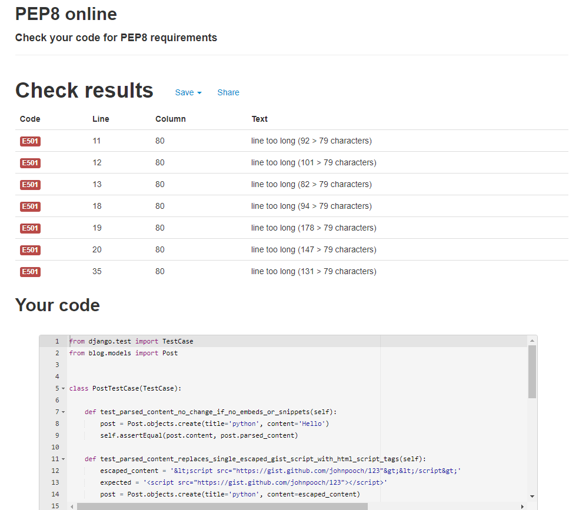

        - urls.py
        
        - 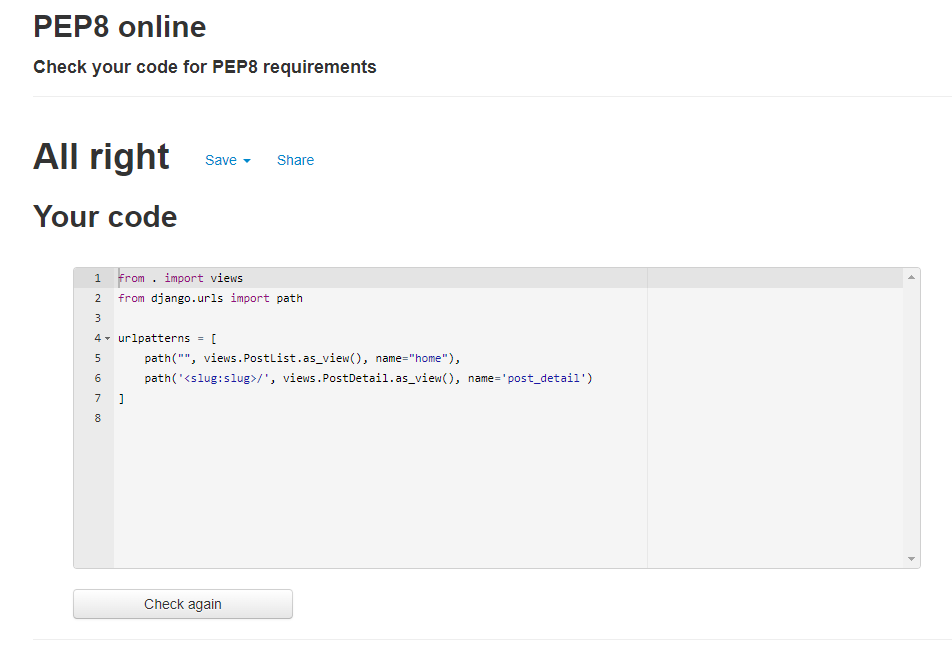

        - views.py
        
        - 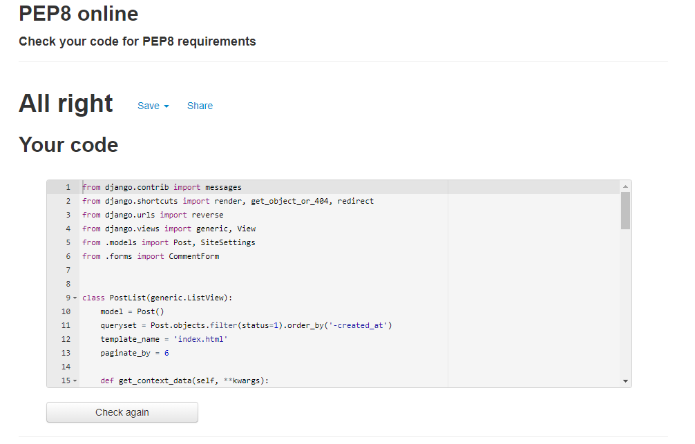

        